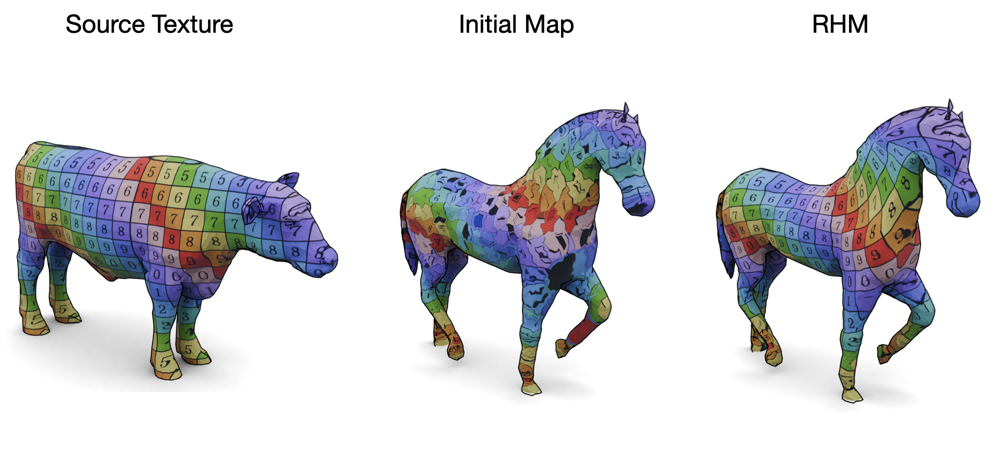

# Reversible Harmonic Maps

A GPU-compatible Python implementation of [Reversible Harmonic Maps between Discrete Surfaces](https://dl.acm.org/doi/10.1145/3202660), based on the paper by Ezuz et al. (2019).

<p align="center">

</p>

[](https://robinmagnet.github.io/ReversibleHarmonicMaps/)


## Overview

This repository provides both NumPy and PyTorch implementations of the algorithm presented in [Reversible Harmonic Maps between Discrete Surfaces](https://dl.acm.org/doi/10.1145/3202660), with the PyTorch version offering GPU acceleration. The codebase leverages the [ScalableDenseMaps](https://github.com/RobinMagnet/ScalableDenseMaps) abstraction for simple representation of point-to-point and point-to-barycentric correspondences.

## Installation

Install the required dependencies:

```bash
pip install pyfmaps libigl pymeshlab
```

Note: The libigl dependency will be removed soon, and we're working on removing the pymeshlab dependency as well.

Clone the repository with submodules:

```bash
git clone --recurse-submodules https://github.com/RobinMagnet/ReversibleHarmonicMaps.git
```


<!-- You can see the usage either  below or in the run the [example notebook](examples/test.ipynb). -->

## Usage Examples

You can see the usage either  below or in the run the [example notebook](examples/test.ipynb).


## Standard Numpy (slow)
Basic usage, using only numpy array is as follows.

Note that the CPU algorithm is very slow, the GPU usage is described below.

```python
from pyFM.mesh import TriMesh
import densemaps.numpy
import rhm.numpy

# Load the meshes
mesh1 = TriMesh("./data/mesh1.off", area_normalize=True, center=True).process(
    k=50, intrinsic=True
)
mesh2 = TriMesh("./data/mesh2.off", area_normalize=True, center=True).process(
    k=50, intrinsic=True
)

# Get an initial map based on e.g nearest neighbors vertex coordinates
P21 = densemaps.numpy.EmbP2PMap(mesh1.vertices, mesh2.vertices)
P12 = densemaps.numpy.EmbP2PMap(mesh2.vertices, mesh1.vertices)

# Refine using RHM
P12_rhm, P21_rhm = rhm.numpy.rhm_refine(mesh1, mesh2, P12, P21, verbose=True)
```

## Fast numpy alternative

An approximate algorithm, significantly faster on CPU can be obtained by using the following parameters for the Reversible Harmonic Map function:

```python
P12_rhm, P21_rhm = rhm.numpy.rhm_refine(mesh1, mesh2, P12, P21, precise=False, last_precise=True verbose=True)
```

In practice, this uses nearest neighbor queries instead of point to face projections in the algorithm, except at the last step of the algorithm.

## Torch

The algorithm beneficiates intensively from GPU parallel computing, especially to improve the very high-dimensional vertex to triangle projections.

The GPU accelerated code works as follows:

```python
import torch
from pyFM.mesh import TriMesh
import densemaps.torch
import rhm.torch

# Load the meshes
mesh1 = TriMesh("./data/mesh1.off", area_normalize=True, center=True).process(
    k=50, intrinsic=True
)
mesh2 = TriMesh("./data/mesh2.off", area_normalize=True, center=True).process(
    k=50, intrinsic=True
)

device = torch.device("cuda:0")
verts1_gpu = torch.from_numpy(mesh1.vertices.astype(np.float32)).to(device=device)
verts2_gpu = torch.from_numpy(mesh2.vertices.astype(np.float32)).to(device=device)

# Get an initial map based on e.g nearest neighbors vertex coordinates
P21 = densemaps.torch.EmbP2PMap(verts1_gpu, verts2_gpu)
P12 = densemaps.torch.EmbP2PMap(verts2_gpu, verts1_gpu)

# Refine using RHM
P12_rhm, P21_rhm = rhm.torch.rhm_refine(mesh1, mesh2, P12, P21, verbose=True)
```

# Citation

If you use this work, please cite the original work by Ezuz et al.:

```bibtex
@article{ezuzReversibleHarmonicMaps2019,
title = {Reversible {{Harmonic Maps}} between {{Discrete Surfaces}}},
author = {Ezuz, Danielle and Solomon, Justin and {Ben-Chen}, Mirela},
year = {2019},
journal = {ACM Trans. Graph.},
}
```

but also the work on scalable maps:

```bibtex
@inproceedings{magnetFmapsLearning,
  title = {Memory Scalable and Simplified Functional Map Learning},
  booktitle = {2024 {{IEEE}}/{{CVF Conference}} on {{Computer Vision}} and {{Pattern Recognition}} ({{CVPR}})},
  author = {Magnet, Robin and Ovsjanikov, Maks},
  year = {2024},
  publisher = {IEEE},
}
```
